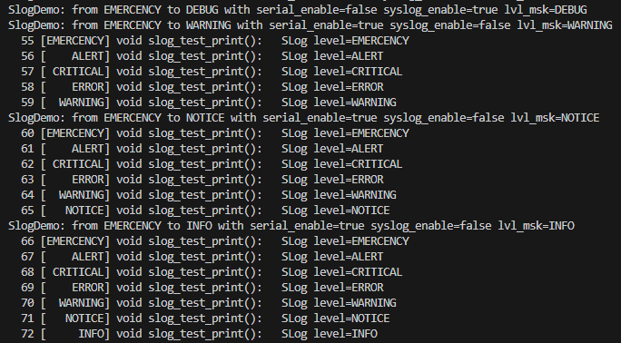
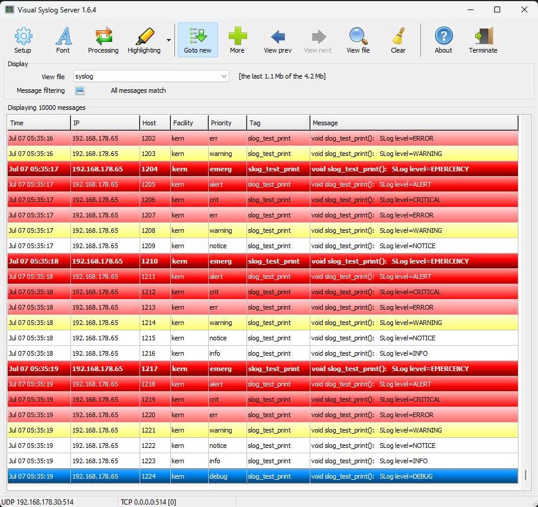

# Slim Logger (SLog)

## English
Small logger for serial interface and network for the ESP32. SLog is used for support during development and for monitoring production systems.
The open source application [Visual Syslog](http://maxbelkov.github.io/visualsyslog/), for example, can be used as a remote receiver.

### Features:
- Support of the serial interface
- Remote logging via WiFi (UDP)
- Individual activation/deactivation of log outputs at runtime
- Prioritization of log messages (8 levels) based on RFC 3164
- Hiding of low-priority messages at runtime
- Hiding of low-priority messages at compile time to reduce memory requirements
- Automatic generation of a sequential number (log number)
- Automatic insertion of the function name in the message
- Output via network based on RFC 3164 (syslog)

### Format and special features of the serial output
- Four-digit log number
- Priority
- The message contains the signature of the function (__PRETTY_FUNCTION__) in which the message is sent
  

Example serial output 
  

### Format and special features of the network output:
- Log number is displayed in the "Host" field
- Facility is always "kern"
- The function name (__FUNCTION__) is in the "Tag" field
- The message contains the signature of the function (__PRETTY_FUNCTION__) in which the message is sent
  

Example network output using Visual SysLog
  

Translated with DeepL.com (free version)

## German
Kleiner Loger für serielle Schnittstelle und Netzwerk für den ESP32. SLog dient zur Unterstützung während der Entwicklung und zum Monitoren von Produktivsystemen.
Als Remote Emfänger kann z.B. die Open Source Anwendung Visual Syslog verwendet werden.

### Merkmale:
- Unterstützung der serielle Schnittstelle
- Remotelogging via WiFi (UDP)
- Individuelle Aktivierung/Deaktivierung der Log-Ausgaben  zur Laufzeit
- Priorisierung der Log-Meldungen (8 Level) in Anlehnung an RFC 3164
- Ausblenden von niederprioren Meldungen zur Laufzeit
- Ausblenden von niederprioren Meldungen zur Compilezeit um den Speicherbedar zu reduzieren
- Automatische Generierung einer Laufenden Nummer (Log-Number)
- Automatisches einfügen des Funktionsnamens in die Meldung
- Ausgaben über Netzwerk in Anlehnung an RFC 3164 (syslog)

### Format und Besonderheiten der seriellen Ausgabe
- Vierstellig Log-Nummer
- Priorität
- Die Meldung enthält die Signatur der Funktion (__PRETTY_FUNCTION__) in der die Meldung abgesetzt wird

### Format und Besonderheiten der Netzwerk Ausgabe:
-  Log-Number wird im Feld "Host" dargestellt
- Facility ist immer "kern"
- Der Funktionsname (__FUNCTION__) steht im Feld "Tag"
- Die Meldung enthält die Signatur der Funktion (__PRETTY_FUNCTION__) in der die Meldung abgesetzt wird
